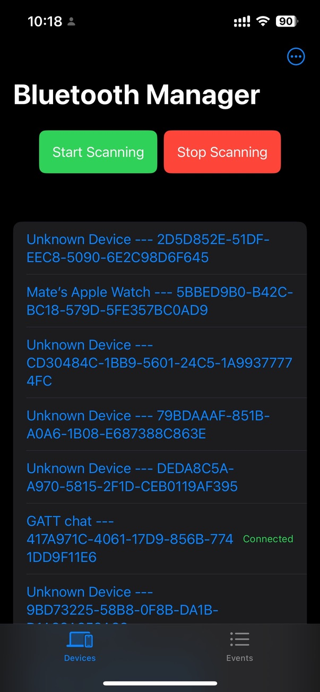
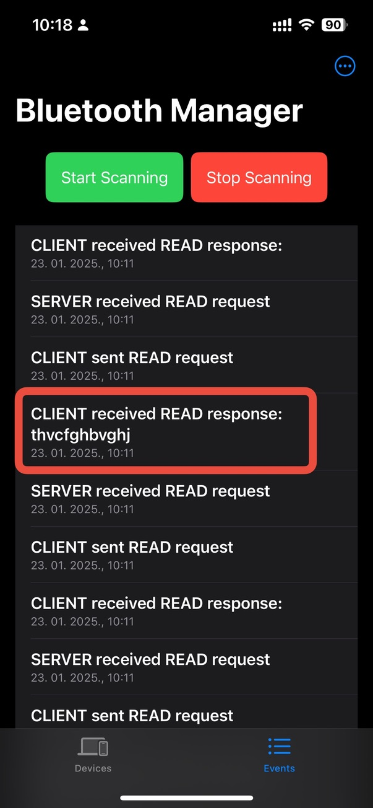
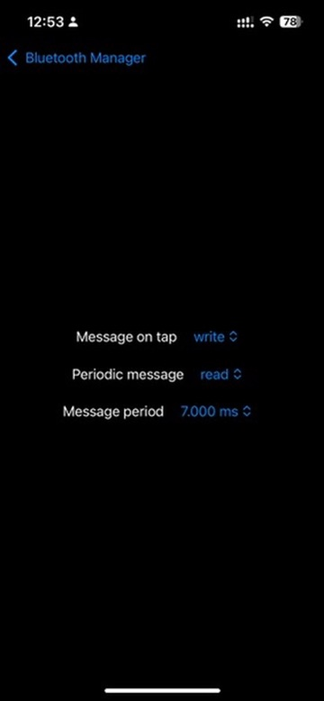

# BLECommunicator
## _iOS application used to communicate with bluetooth low energy servers and clients_

When i was developing [BluetoothChat](https://github.com/mgranic/BluetoothChat) i didn't have 2 Android devices to test Bluetooth communication so i developed another app on my iPhone for testing purpouses. Application is costumizable to some degree in order to be able to test different types of BLE communications but it is basically hardcodded for [BluetoothChat](https://github.com/mgranic/BluetoothChat) testing in terms of GATT services and characteristics.

In some future versions of this app (if there are any) i will fix this part and make it fully customizable

## Features

- scan for bluetooth devices
- connect to device and send/receive messages between devices
- customize commmunication to be periodic or not, read or write messages and change message period
- display communication history (events)

## Main screen
- start scanning for devices
- stop scanning the devices
- show discovered devices in a list on a screen
- here the device we are looking for is "GATT chat"

### Device list
- by default on main screen device list is shown (see toolbar)
- if you tap on a device it will connect to it and start snding messages selected in settings (periodic)
- if you tap again on connected device it will again send message selected in settings (one time)

### Event list
- selecting Events in toolbar shows list of events
- each event is message being sent or received by client or server on your device
- it also shows data bein sent or received
- in red sqare is message received from server on another device with data

### Settings screen
- message on tap, which message is sent when taping on already connected device (one time)
- periodic message is message being sent all the time when connected to a device
- message period is period of a periodic message

